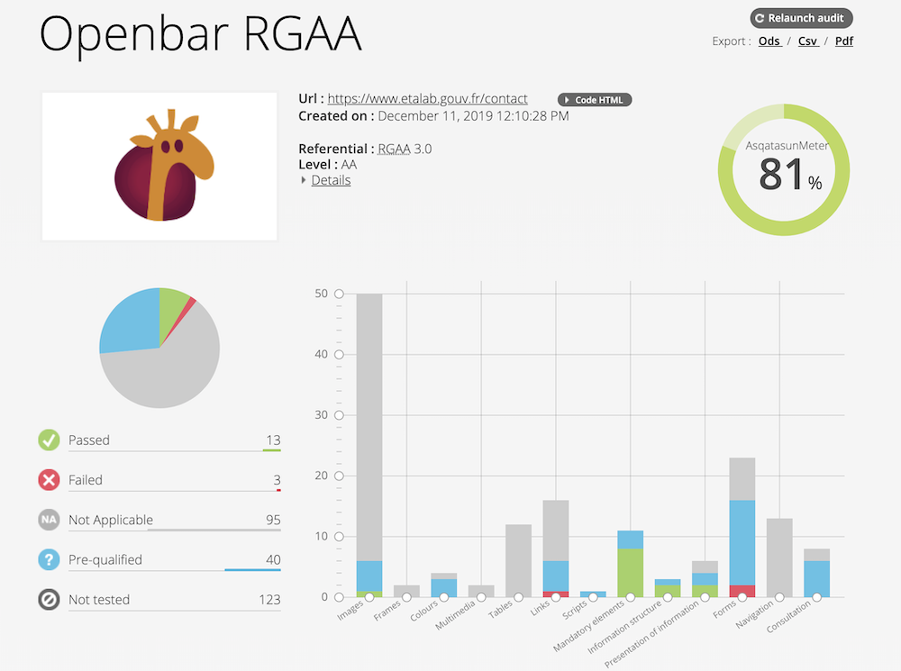

*[RGAA]: Référentiel Général d'Amélioration de l'Accessibilité
*[DILA]: Direction de l'information légale et administrative
*[WCAG]: Web Content Accessibility Guidelines (Règles pour l'accessibilité des contenus Web)
*[WAI]: Web Accessibility Initiative (L'Initiative sur l'Accessibilité du web)

# Accessibilité 

Initialement relatif au monde du handicap, des enfants ou des personnes âgées, l’accessibilité s'est étendue à l'ensemble des citoyens et utilisé pour désigner l'accès à de nombreux domaines : **physique**, la liberté de déplacement dans l’espace (mobilité) ; **éducatif**, le droit à une scolarisation ; **civique**, le droit de vote ; **culturel**, pouvoir développer sa culture ; **numérique**, adaptation des systèmes numériques, dont les sites web, aux différents types de handicap, développement d'outils spécifiques tels loupe ou clavier visuel...

[[toc]]

## Comprendre le RGAA 4 

RGAA signifie Référentiel Général d'Amélioration de l'Accessibilité. Ce référentiel est actuellement en **version 4** à l'adresse suivante : [https://www.numerique.gouv.fr/publications/rgaa-accessibilite/](https://www.numerique.gouv.fr/publications/rgaa-accessibilite/)

> « L'accessibilité numérique consiste à rendre les services de communication au public en ligne accessibles aux personnes handicapées » — RGAA 4

Le Référentiel Général d'Amélioration de l'Accessibilité (RGAA) est un document initialement pensé pour tester votre site ou service numérique a posteriori. C'est à dire lorsque celui-ci est finalisé. 

Les règles et principes pour l'accessibilité des contenus web, qui sont proposées à travers ce référentiel, reposent sur les [WCAG 2.0 (Règles pour l'accessibilité des contenus Web du W3C)](https://www.w3.org/Translations/WCAG20-fr/), rédigées par la [WAI](https://www.w3.org/WAI/) initié en 1997.

::: tip Changement de nom du Reférentiel Général entre la version 3 et 4
RGA.A. version 3 : Accessibilité pour les Administrations

RGA.A. version 4 : Amélioration de l’Accessibilité 
:::

::: danger Version antérieure
Cette URL est donc obsolète : [http://references.modernisation.gouv.fr/rgaa-accessibilite/](http://references.modernisation.gouv.fr/rgaa-accessibilite/)
:::

### Principes

L’accessibilité numérique repose sur les 4 grands principes d’un site web accessible. Ainsi, ce dernier se veut **perceptible** (pouvant proposer la même information sous plusieurs formes et assurant l’équivalence entre les contenus), **utilisable** (avec toutes les fonctionnalités accessibles au clavier et accompagnant l’utilisateur dans sa navigation), **compréhensible** (proposant un contenu textuel lisible et intelligible et évitant les erreurs de saisie) et **robuste** (assurant une compatibilité avec différentes configurations y compris les technologies d’assistance).

### Obligations 

Les obligations du RGAA sont :
- principalement pour les administrations ;
- quelques contenus sont exemptés (bureautiques ancien, des contenus audio et vidéo diffusés en direct…) ;
- reprenant des règles pour l'accessibilité des contenus Web (WCAG) 2.1 de niveau simple A et double A (AA) ;
- avec possible dérogation si la charge est disproportionnée (budget, effectifs…) ;
- avec évaluation/audit de la conformité à la norme de référence.

### Évaluation / Audit

Il est possible de s'auto-évaluer ou de faire appel à un tiers (expert) pour auditer la conformité à la **norme de référence**.

Cet audit abouti à une **déclaration d’accessibilité**.

Il est nécessaire d'**échantillonner** son audit. C'est-à-dire qu'il vous faut choisir vos pages principales à auditer : accueil, contact, authentification, mentions légales… 

### Déclaration d'accessibilité

La déclaration d'accessibilité permet de :
- Définir l'**état de conformité** (total, partiel, non-conforme)
	- Total = 100% des critères de la **norme de référence** sont respectés
	- Partiel = +50% des critères sont respectés
	- Non-conforme = -50% des critères sont respectés
- Signaler des contenus non accessibles
- Définir les dispositifs d'assistance et de contact
- Mentionner l’appel au Défenseur des droits si nécessaire

::: tip
Le **% des critères respectés** = Nb **critères respectés** / Nb **critères applicables**

Il faut donc commencer par définir les critères applicables avant de vérifier s'ils sont respectés. Nous pouvons aussi parler de critères valides.
:::

### Publications

Une page « accessibilité » doit être publiée et doit contenir :  
- La déclaration d’accessibilité
- Le schéma pluriannuel de mise en accessibilité 
- Le plan d'actions de l’année

Cette page doit se nommer selon l'état de conformité :
- « Accessibilité : totalement conforme »
- « Accessibilité : partiellement conforme »
- « Accessibilité : non conforme » 

::: tip Exemples 
Une page accessibilité bien documentée : [www.service-public.fr/P10000](https://www.service-public.fr/P10000)

Page accessibilité initiée : [www.etalab.gouv.fr/accessibilite](https://www.etalab.gouv.fr/accessibilite)
:::

### Norme de référence - Critères & tests

Les critères à respecter définissent la **norme de référence**.

Il existe 106 critères de contrôle RGAA (dont 50 critères de succès des niveaux A et AA de la [norme internationale WCAG 2.1](https://www.w3.org/TR/WCAG21/)).

Pour vérifier ces critères il existe des tests. Et il existe en moyenne de 2,5 tests par critère.

Ces critères sont organisés en **thématiques** (images, cadres, couleurs, liens, tableau...).

::: tip Exemples de critères 
RGAA 1.1 — Chaque image porteuse d'information a une alternative textuelle

RGAA 1.2 — Chaque image de décoration est correctement ignorée par les technologies d'assistance 

RGAA 3.1 — L'information ne doit pas être donnée uniquement par la couleur.

RGAA 3.2 — Le contraste entre la couleur du texte et la couleur de son arrière-plan est suffisamment élevé

RGAA 4.1 —Chaque média temporel pré-enregistré a-t-il, si nécessaire, une transcription textuelle ou une audiodescription

RGAA 8.5 — Chaque page comporte un titre `<title>` 

RGAA 12.1 — Chaque ensemble de pages dispose au moins de deux systèmes de navigation différents
::: 

## Outils utiles

### Tests rapides du code (HTML, CSS)

Il existe un moyen d'auditer automatiquement et rapidement une page web à travers l'outil **[app.asqatasun.org](https://app.asqatasun.org)** (la version libre et gratuite de **Tanaguru**). 

Cela donne l'avantage d'avoir une image rapide de qui est accessible ou non/ Mais cela est très peu qualitatif au regard du nombre de critères testés automatiquement (variant autour de 5% à 25%).

_Exemple de résultat de l'application Asqatasun_

D'autres outils de ce type existent comme :
- [https://validator.w3.org/unicorn/?ucn_lang=fr](https://validator.w3.org/unicorn/?ucn_lang=fr)
- [http://jigsaw.w3.org/css-validator/](http://jigsaw.w3.org/css-validator/)

### Plugin RGAA

Il existe également un plugin qui permet d'avoir sous la main dans son navigateur les critères et tests du RGAA. Malheureusement celui-ci est dans la version 3 du RGAA et uniquement sur Chrome.

Télécharger l'[assistant RGAA (pour Chrome)](https://chrome.google.com/webstore/detail/assistant-rgaa/cgpmofepeeiaaljkcclfldhaalfpcand?hl=fr)

### Checklist Pidila

La Checklist Pidila regroupe les critères des différents référentiels et bonnes pratiques du web à commencer par le Référentiel général d’amélioration de l’accessibilité (RGAA), mais aussi les critères du Cerfa numérique, de la Charte internet de l'État, du Référentiel général d'interopérabilité (RGI), des bonnes pratiques Opquast…

C'est l'outil de travail des équipes de la DILA (en charge du site web [service-public.fr](service-public.fr)) pour gérer la qualité de ses sites internet.

Cette liste dispose d'un moteur de recherche et peut également être filtrée par profil, référentiel ou thématique.

::: tip
Au commencement, concernant le RGAA, nous vous conseillons de filtrer les critères sur les profils suivants : **Pilotage**, **Conception**, **Graphisme**, puis **Rédactionnel**.
:::

### Mozilla Developer Network

Mozilla Developer Network ou MDN, est un site internet hébergé par la fondation Mozilla qui rassemble de la documentation sur les technologies du web, et donc sur l'[accessibilité dans le développement web](https://developer.mozilla.org/fr/docs/Accessibilit%C3%A9). De nombreux tutoriels, ressources et outils sont ainsi listés et traduits en français.

### A11yproject

Le projet [a11yproject](https://a11yproject.com/) est né de la communauté open source et offre également de nombreux conseils et bonnes pratiques pour l'amélioration de l'accessibilité du web.

## Annexes 

::: tip Présentation 
Voir la présentation : [Accessibilité & RGAA](https://speakerdeck.com/eig2018/presentation-accessibilite-rgaa)
:::
