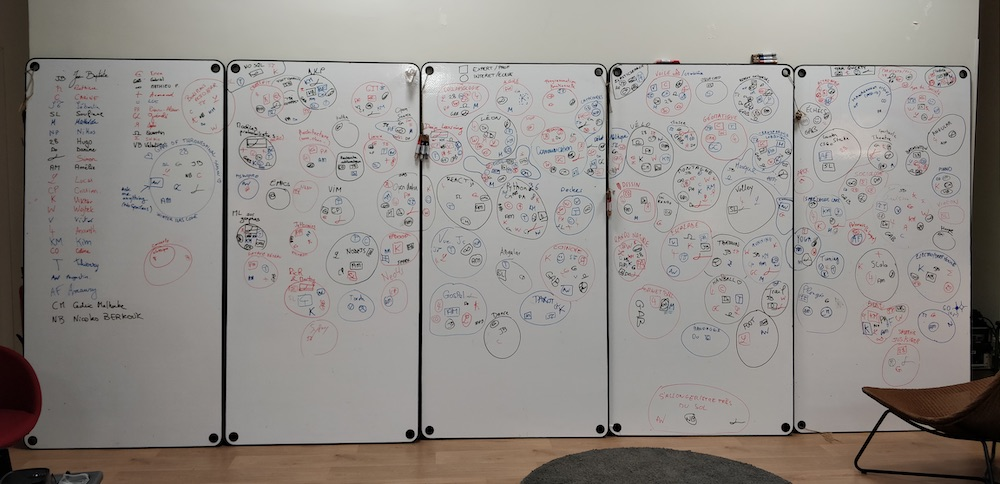
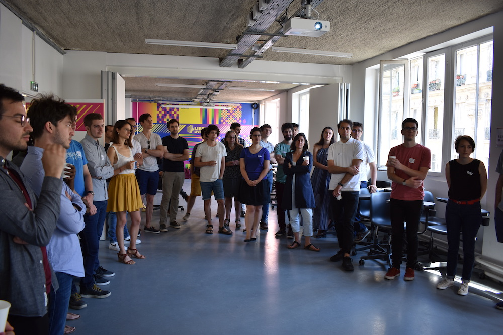
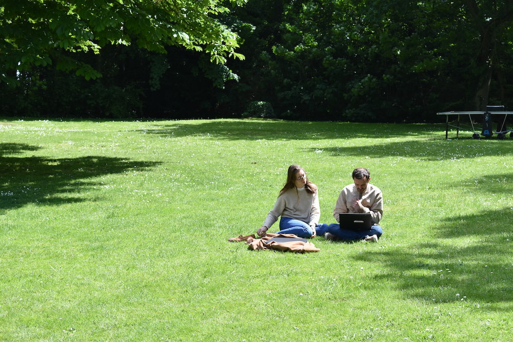
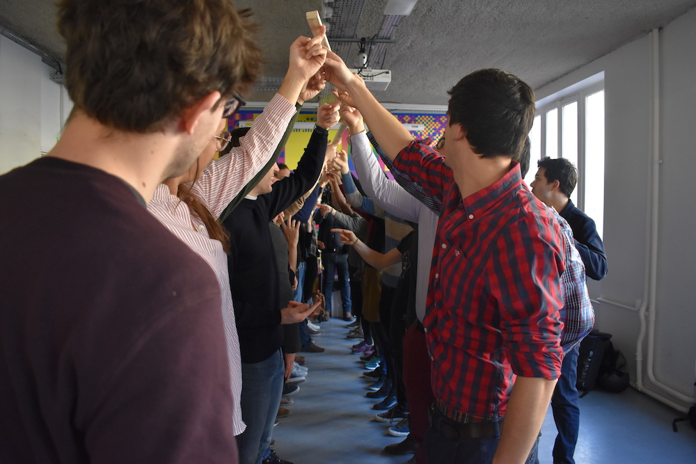
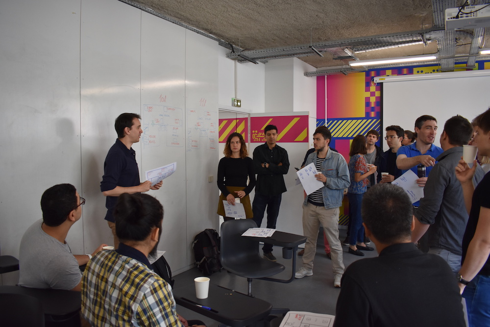

# Animations EIG

## Bulloterie 

La Bulloterie est un outil ludique de mise en relation par intérêts et savoir-faire, en groupe affinitaire (à travers des bulles). Elle permet aux EIG, en début de promotion, de se rencontrer et de se découvrir autour du support de l'outil. 

Pour plus d'information voir la [documentation complète sur la Bulloterie](https://movilab.org/wiki/La_Bulloterie)

Une Bulloterie a été réalisée en début de chaque promotion EIG, à l'exception de la première. Nous avons principalement eu l'occasion d'avoir de grands tableaux blancs pour réaliser nos Bulloteries. Nous conseillons ce support pour faciliter la saisie, bien qu'il soit possible de la réaliser sur papier. 

Nous avons souvent conceptualisé 3 niveaux par intérêts ou savoir-faire :
- Si je me retrouve dans un intérêt ou un savoir-faire (une bulle), je m'inscris dans la bulle avec mon signe ;
- Si je pense être expert dans un intérêt ou un savoir-faire (une bulle), je m'inscris en encadrant mon signe ;
- Si je suis débutant ou avec la volonté d'apprendre dans un intérêt ou un savoir-faire (une bulle), je m'inscris en entourant avec un cercle mon signe.

Souhaitant conserver une trace tout au long de la promotion, nous avons représenté la Bulloterie sous forme d'un graphe. 

Pour comprendre l'intégration sous la forme d'un graphe voici la [documentation explicative](bulloterie.md).

 _Résultat de la Bulloterie au Lab110bis en Février 2019_

## Stand-up

Le stand-up est une activité mensuelle pour la promotion afin de partager actualités, ambiance, avancement, retournement de situation de chaque défi. Nous sommes debout, tous ensemble, en cercle. Le stand-up dure entre 20 et 30 minutes. Chaque défi dispose d'une minute maximum, pour partager ses informations au reste de la promotion. Le stand-up se réalise bien souvent en début de [plénière](animation.md#sessions-plénières) (entre 10h et 10h30). 

Nous avons repris l'outil stand-up de beta.gouv.fr et nous l'avons adapté aux 2 dernières promotions. Lien vers l'outil : [http://standup.eig-forever.org](http://standup.eig-forever.org) (voir le [code source](https://github.com/entrepreneur-interet-general/standup) de celui-ci).

 _Stand-up avec des EIG et des DIG_

## Forum Ouvert

Le **Forum Ouvert** est un moyen de partager des compétences ou des connaissances, autour de sujets ou de thèmes dans lequel les défis sont abordés. Lors des sessions plénières passées, un forum ouvert a souvent été proposé en deux temps l'après-midi. 

Concrètement, il est demandé aux EIG les thèmes ou les sujets qu'ils souhaitent proposer sur la thématique du jour. Les EIG proposant un sujet le font savoir au reste de la promotion. Une fois les propositions terminées, les EIG se répartissent dans les différents espaces du tiers-lieu selon leurs intérêts. 

Par exemple, si un Forum ouvert porte sur l'accessibilité. Des personnes peuvent proposer à une assemblée : une présentation accélérée du RGAA, un design review des maquettes ou prototype déjà réalisés sur cet axe, une présentation pour découvrir le Facile à lire et à comprendre (FALC), un retour d'expérience sur des démonstrations réalisées par des non-voyants et les formalités pour obtenir le label e-accessible sur son site. Ces personnes sont mises en évidence afin de bien les identifier. Ensuite, les autres personnes de l'assemblée peuvent suivre ou s'inscrire auprès de la personne ayant proposé son sujet. 

Pour en savoir plus, voir l'[article Wikipédia sur le Forum Ouvert](https://fr.wikipedia.org/wiki/M%C3%A9thodologie_Forum_Ouvert).

## Pair-à-pair ou « _peer learning_ »

Le mode de collaboration ou d'apprentissage en [pair-à-pair](https://fr.wikipedia.org/wiki/Processus_collaboratif_pair_%C3%A0_pair) est le mode d'interaction entre deux ou plusieurs individus sur un sujet donné. Ce nom est inspiré du « [peer-to-peer](https://fr.wikipedia.org/wiki/Pair_%C3%A0_pair) », issus du monde informatique. Les collaborateurs ne sont pas soumis à une autorité hiérarchique et chacun est libre de contribuer sans sélection préalable. Ce mode d'animation est donc possible que si le contexte le permet. Les plénières, le bootcamp et le semainière permettent ainsi d'obtenir une volonté de *"créer quelque chose qui soit directement utile aux autres contributeurs (en créant une valeur d’usage, et non une valeur d’échange)"* (cf. [Le Pair-à-Pair, nouveau modèle de société centré sur les communs](http://blogfr.p2pfoundation.net/2017/06/17/pair-a-pair-nouveau-modele-de-societe-centre-communs/))

Il est possible d'obtenir des modes d'interaction en pair-à-pair pendant une session plénière. Mais plus généralement, les temps en séminaire permettent plus facilement ce mode de collaboration. 

 _Deux EIG s'entraident pendant un seminaire_

## EIG « off »

La définition et la liste des EIG « off » produits sont dans la page : [EIG « off »](eig-off.md)

## « Ice breaker »

Un _ice breaker_ (ou « brise-glace » en français) est un atelier ou un jeu, utilisé pour initier le dialogue entre plusieurs participants amenés à évoluer ensemble, pour renforcer l’esprit de groupe ou s'implement pour se reveiller le corp et l'esprit.

### Compter le plus possible

L'objectif de cet ice breaker est de compter (1, 2, 3...) individuellement et dans une équipe, le loin possible, sans jamais se couper la parole. 

Contraintes :
- le chiffre doit être enoncé par une seule personne à la fois 
- il est interdit de parler, à part pour dire un chiffre
- il faut au minimum 2 équipes d'au moins 5 personnes (possible de faire 10 équipes de 10 personnes)

Règles : 
- Si deux personnes disent un chiffre en même temps, le comptage recommence à zéro
- Si une personne parle, le comptage recommence à zéro

Le challenge est de faire le comptage le plus élevé possible au regard des équipes adverses.

C'est un exercice sous forte contrainte qui demande l'attention auprès de l'ensemble des personnes présentes. Car en silence, il n'est pas évident d'enoncer qu'un chiffre, sans couper la parole.

Durée : 15min

### Pose de bâton 

L'idée est simple : poser un baton au sol tenu par des participants avec leur doigts. 

Pour cela il faut :
- mettre les personnes deux par deux en file indienne, comme si l'on souhaitais faire un couloir
- poser le bâton dans ce couloir
- lever le bâton tous ensemble
- tenir tous ensemble le baton avec un seul doigt 
- poser le baton (ça peut être long)

Nous avons dû scotché plusieurs baton ensemble afin de tous pouvoir tenir le baton.

Durée : 15min (préparation, explication et pose)

 _Des EIG en train de se demander pourquoi le bâton ne descend pas_

## « Speed pitching » 

L'animation « speed pitching » est un atelier en collectif pour tous les défis EIG. Le _speed pitching_ permet de rencontrer rapidement plusieurs défis, individuellement, comme un *[speed dating](https://fr.wikipedia.org/wiki/Speed_dating)*. Il a été aussi nommé "speed dating défis". L'objectif du _speed pitching_ est de présenter, rapidement et à plusieurs reprises, son défi (problématique, solution, impact) sous la forme d'un *pitch*. Le *pitch* est une présentation courte d'un produit ou d'un projet, de manière convaincante et engagé, souvent dans un but promotionnel.

Cet atelier est une création de [Jean-Baptiste Le Dévéhat (EIG Link 2019)](https://entrepreneur-interet-general.etalab.gouv.fr/communaute/2018/jean-baptiste-le-devehat.html).

### Format du speed pitching

Sur un stand, chaque défi présente son projet à une autre équipe défi. 
- Le cycle du speed pitching est de **15min** :
    - Le défi pitche **5min** devant un autre défi.
    - Les 2 défis peuvent échanger pendant **10min**.

**Attention** au bout de 15min :
- Le défi qui écoute passe à un autre défi 
- Le défi qui présent reste sur place et voit un nouveau défi arriver   
_Exemple : ACOSS Plateforme présente son défi à IA Flash. 15 minutes après, IA Flash part écouter Adler, et l'équipe ACOSS Plateforme présente à nouveau son défi, à Karfu'R..._

Les défis sont répartis en 2 groupes de 8 (A et B). C'est à dire : 8 défis pitchent à la fois. 
Pendant 1 heure, le groupe A présente et le groupe B écoute. Au bout d'1 h, les rôles s'inversent.

 _Présentation du déroulement du speed pitching_

### Exemple pendant une plénière

**De 10h à 11h** :
- Le **groupe A** est le groupe de défis qui *pitche*. Ils pourront présenter leur défis 4 fois.
- Le **groupe B** est le groupe de défis qui écoute. Ils pourront échanger avec les défis qui pitcheront.

**De 11h à 12h** : Nous inversons les rôles du groupe A et B 
- Le **groupe B** est le groupe de défis qui *pitche*. Ils pourront présenter leur défis 4 fois.
- Le **groupe A** est le groupe de défis qui écoute. Ils pourront échanger avec les défis qui pitcheront.

::: details 

**Détails des groupes et du planning des rotations**

Groupe A : 
1. ACOSS Plateforme
2. Adler
3. CartoBio
4. CibNav
5. DataJust
6. DataReg
7. EIGLink
8. ExploCode

Groupe B : 
1. IA Flash
2. Karfu'R
3. LexImpact
4. OpenChronic
5. OpenJustice
6. Plume (Rédaction)
7. Plume (Exploration)
8. Polygraphe

**de 10h à 11h :**

| Stand Pitch | 10h | 10h15 | 10h30 | 10h45 | 
| -------- | -------- | -------- | -------- | -------- |
| 1. ACOSS Plateforme | IA Flash | Karfu'R| LexImpact | OpenChronic|
| 2. Adler | Karfu'R | LexImpact | OpenChronic |OpenJustice|
| 3. CartoBio | LexImpact | OpenChronic |OpenJustice|Plume (Redac) | 
| 4. CibNav | OpenChronic | OpenJustice |Plume (Redac) | Plume (Explo)| Polygraphe |
| 5. DataJust | OpenJustice |Plume (Redac) | Plume (Explo)| Polygraphe |
| 6. DataReg | Plume (Redac) | Plume (Explo)| Polygraphe |IA Flash |
| 7. EIGLink | Plume (Explo) |Polygraphe |IA Flash | Karfu'R|
| 8. ExploCode | Polygraphe |IA Flash | Karfu'R| LexImpact |

**11h : inversion des rôles des groupes A et B**

**de 11h à 12h :**

| Stand Pitch | 11h | 11h15 | 11h30 | 11h45 | 
| -------- | -------- | -------- | -------- | -------- |
| 1. IA Flash | ExploCode | EIGLink | DataReg | DataJust |
| 2. Karfu'R | EIGLink| DataReg| DataJust|CibNav|
| 3. LexImpact | DataReg| DataJust|CibNav| CartoBio|
| 4. OpenChronic | DataJust|CibNav| CartoBio| Adler|
| 5. OpenJustice | CibNav| CartoBio| Adler| ACOSS Plateforme|
| 6. Plume (Redac) | CartoBio| Adler| Accos| ExploCode|
| 7. Plume (Explo) | Adler| Accos| ExploCode |EIGLink |
| 8. Polygraphe | Accos| ExploCode |EIGLink |DataReg | 

:::

## Rushs

Ce sont 2 ateliers créé par [Hugo Stephan]https://entrepreneur-interet-general.etalab.gouv.fr/communaute/2019/hugo-stephan.html) lors de la session plénière du 10 octobre 2019. 

## Rush dating

Objectifs :

 - Partager ses problématiques de production liées au rush de fin (tech, Dev, biz Dev, lancement, pérennisation, documentation, sécu…)
 - Obtenir des retours de défis qui ont des problématiques similaires histoire de : solutionner, pleurer tous ensemble, maudir la ou les raisons de vos malheurs, inventer des parades, s’entraider
 - Et inversement : la sensation de réciprocité est importante.

Format : 2 phases d’une heure

Détails d’une phase :

 - Les binômes de défi cherchent un autre binôme pour échanger ;
 - Une fois que le match est fait : ils s’installent pour une heure d’échange ;
 - Au bout de 30 minutes, un gong retenti pour inverser les problématiques si besoin ;"	

### Rush clinic

Objectifs :

 - Approfondir certaines problématiques en bénéficiant notamment de la présence des mentors : résoudre des problèmes stratégiques, liés à la pérennisation...
 - Échanger à plusieurs en tant que EIG, pas forcément en binôme.

Format :

 - Durée : 1 heures 30
 - Chaque porteur de problématique accueille jusqu'à 5 personnes pour 1 heure d’échanges ;
 - Le format permet aux défis qui passent les vidéos de s’éclipser et de s’ajouter plus facilement dans les groupes."			

 Ce format se rapproche d'un Forum ouvert avec la volonté supplémentaire de le prévoir en amont du jour J.				