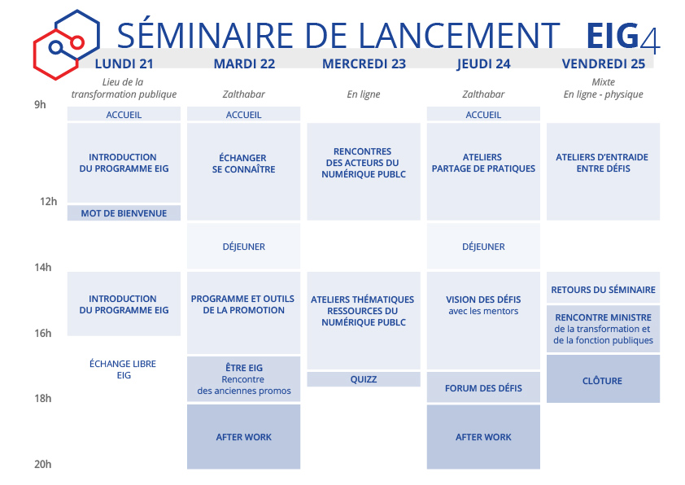

# Bootcamp EIG4 - 21 au 25 septembre 2020

[[toc]]

## Programme de la semaine et informations pratiques

### Lundi 21 septembre, 9h - 17h
**Le Lieu de la Transformation publique**, 77 avenue de Ségur, 75015 Paris

| Horaires |  |
| -------- | -------- | 
| 9h - 9h30 | Accueil au lieu de la Transformation publique |
| 9h - 12h |  Introduction du programme EIG  |
| 12h - 12h30 |  Mot de Bienvenue de Nadi Bou Hanna, Directeur du numérique et du système d'information et de communication de l'État |
| 12h30 - 14h | Déjeuner libre |
| 14h - 16h | Premiers pas dans l'adminitsration |
| 16h00 - 18h | Échange libre entre EIG : Verre à coté du Lieu |

### Mardi 22 septembre, 9h - 18h00 + after work
**Zalthabar**, 48 Rue de Villiers, 92300 Levallois-Perret

| Horaires | Thématique | 
| -------- | -------- |
| 9h - 9h30 | Accueil au Zalthabar |
| 9h - 12h30 | Échanger et se connaitre |
| 12h30 - 14h | Déjeuner sur place |
| 14h - 16h | Programme et outils de la promotion |
| 16h - 18h | Être EIG, rencontre des anciennes promos |
| 18h - 20h| AfterWork (optionnel) |

### Mercredi 23 septembre, 9h30 - 17h30
**En ligne** : Renontres et ateleirs en visioconférences

| Horaires | Thématique | Public | Lieu | 
| -------- | -------- | -------- | -------- | 
| 9h30 - 12h30 | rencontre des acteurs des services publics numériques | | - |
| 12h - 14h | Pause | | |
| 14h - 17h00 | Ateliers Découverte des ressources | | - |
| 17h - 17h30 | Quizz | | - |

### Jeudi 24 septembre, 9h - 18h + after work
**Zalthabar**, 48 Rue de Villiers, 92300 Levallois-Perret

| Horaires | Thématique |
| -------- | -------- |
| 9h - 12h30 | Ateliers partage de pratiques |
| 12h30 - 14h | Déjeuner sur place |
| 14h - 14h30 | Accueil et partage avec les mentors|
| 14h30 - 17h00 | Visions des défis, travail avec les mentors|
| 17h - 18h00 | Forum des défis |
| 18h - 20h00 | After Work (optionnel) |

### Vendredi 25 septembre, 9h30 - 18h00
**Mixte** : en ligne / en physique

| Horaires | Thématique | Public | Lieu | 
| -------- | -------- | -------- | -------- | 
| 9h30 - 12h30 | Ateliers d'entraide entre défis | | Organisation libre |
| 12h - 14h | Pause | | |
| 14h - 15h00 | Retours sur le bootcamp | | A définir |
| 15h - 17h30 | Rencontre de la ministre Amélie de Montchalin | | Ministère de la Transformation et de la Fonction publiques |
| 17h30 - 18h00 | Clôture | | |

