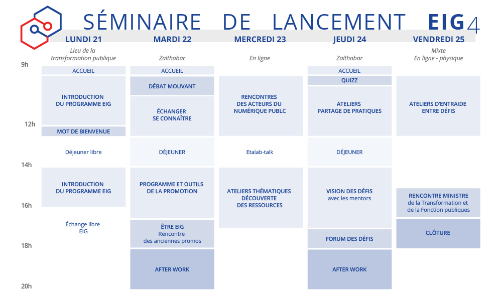

# Séminaire de lancement

[[toc]]

## Les essentiels

**Quelques temps forts à prévoir**

* **Mardi matin**, chacun.e sera invité à parler de soi et de son métier, un projet ou événement qui vous tient à coeur, une compétence particulière ou autre. Venez avec quelques anecdotes !
* **Les mentors des défis seront présents jeudi après-midi**. Ça sera un temps d'échange et de discussion sur la vision des défis, suivi d'une rencontre avec les autres équipes. Tout le monde est ensuite conviés à l'afterwork qui aura lieu sur place.
* **Les déjeuners** du mardi et du jeudi sont fournis et servis au Zalthabar. Lundi, c'est un déjeuner libre autour du Lieu de transformation publique. 

**Contacts utiles :** Pendant le séminaire, vos points de contact seront les EIG Links - Raphaëlle et Coline. L'équipe sera joignable et disponible pour toutes les questions et remarques, sur le slack, téléphone ou directement sur place.

**Rappel :** *Les conditions d'accueil et d'animation du séminaire sont adaptées afin qu’il se déroule dans les meilleures conditions d’hygiène et de sécurité. Le port du masque sera obligatoire pendant tout le séminaire et chacun.e est invité à respecter les consignes de distanciations sociales.* 

## Programme de la semaine

### Lundi 21 septembre, 9h - 16h *+ verre*
**Le Lieu de la Transformation publique**, 77 avenue de Ségur, 75015 Paris.
Code d'accès dans le slack

| Horaires |  |
| -------- | -------- | 
| 9h - 9h30 | Accueil au lieu de la Transformation publique |
| 9h - 12h |  Introduction du programme EIG  |
| 12h - 12h30 |  Mot de bienvenue de Nadi Bou Hanna, Directeur du numérique et du système d'information et de communication de l'État |
| 12h30 - 14h | Déjeuner libre auto-organisé |
| 14h - 16h | Premiers pas dans l'adminitsration |
| 16h00 - 18h | *optionnel* Échange libre entre EIG : Verre à coté du Lieu |

### Mardi 22 septembre, 9h - 18h00 *+ after work*
**Zalthabar**, 48 Rue de Villiers, 92300 Levallois-Perret

| Horaires |  | 
| -------- | -------- |
| 9h - 9h30 | Accueil au Zalthabar |
| 9h30 - 10h30 | Intervention de Clément Mabi, Maître de conférence en études de communication |
| 10h30 - 12h30 | Échanger et se connaitre |
| 12h30 - 14h | Déjeuner prévu sur place |
| 14h - 16h | Programme et outils de la promotion |
| 16h - 18h | Être EIG, rencontre des anciennes promotions |
| 18h - 20h| *optionnel* AfterWork  |

### Mercredi 23 septembre, 9h30 - 17h30
**En ligne**

* **9h30 - 12h : Rencontre des acteurs du numérique publics**

| Horaires | Visio 1 | Visio 2 | Visio 3 |
| -------- | -------- | -------- | -------- | 
| 9h30 - 9h50 | API.gouv | | France Connect |
| 9h50 - 10h10 | Data.gouv | Cadre légal | Design.gouv |
| 10h10 - 10h30 | ressources cartographiques | Algorithmes publics| Designers Beta.gouv |
| 10h30 - 10h50 |  | LabIA | Beta.gouv, startups d'État |

* **11h - 12h : Présentation du laboratoire Linc, CNIL** - Régis Chattelier
* **12h30 - 13h30 : *optionnel* Etalab-talk : Ioana Manolescu** - De l'accessibilité des statistiques aux entrepôts de données hétérogènes: outils pour le data journalisme

* **14h - 17h00 : Ateliers thématiques - Découverte des ressources**

| Horaires | ATELIER 1 | ATELIER 2 | 
| -------- | -------- | -------- |  
| 14h - 15h | Open Data, Mathilde Hoang - Etalab | Numérique responsable, Richard Hanna - DINUM |
| 15h - 16h | Open Source, Bastien Guerry - Etalab | Accessibilité, Benoît Dequick - Design.gouv |
| 16h - 17h | LabIA, Kim Montalibet - Etalab | Design system, Jean-Charles Hourdeaux - SIG |

**17h - 17h30 : Retours et Quizz de clôture**

### Jeudi 24 septembre, 9h - 18h *+ after work*
**Zalthabar**, 48 Rue de Villiers, 92300 Levallois-Perret

| Horaires |  |
| -------- | -------- |
| 9h - 12h30 | Ateliers partage de pratiques |
| 12h30 - 14h | Déjeuner prévu sur place |
| 14h - 14h30 | Accueil des mentors|
| 14h30 - 17h00 | Visions des défis, travail avec les mentors|
| 17h - 18h00 | Forum des défis |
| 18h - 20h00 | *optionnel* After Work  |

### Vendredi 25 septembre, 9h30 - 18h00
* **Matinée** : Ateliers en ligne ou en physique
* **Après-midi : Ministère de la Transformation et de la Fonction publiques** : Hôtel de Rothelin-Charolais, 101 rue de Grenelle, 75007 Paris
Prévoir une pièce d'identité pour l'entrée.

| Horaires |  | 
| -------- | -------- | 
| 9h30 - 12h30 | Ateliers d'entraide entre défis - Organisation libre en équipe |
| 14h - 15h00 | Retours sur le bootcamp ( lieu à définir) |
| 15h - 17h30 | Rencontre avec Amélie de Montchalin, Ministre de la Transformation et de la Fonction publiques  |
| 17h30 - 18h00 | *optionnel* Clôture |

=======
# Bootcamp de lancement

## Programme du 21 au 25 septembre 2020

| Date | Horaires | Thématique | Public | Lieu | 
| -------- | -------- | -------- | -------- | -------- | 
| **Lundi 21 septembre** | 9h - 17h | Accueil et premiers retours | | Lieu de la Transformation publique |
| **Mardi 22 septembre** | 9h - 18h |  Être EIG | | Zalthabar |
|  | 18h - 20h | AfterWork (optionnel) |  | Zalthabar |
| **Mercredi 23 septembre** | 9h30 - 17h30 | Acteurs et ressources du numérique public| | En ligne |
| **Jeudi 24 septembre** | 9h - 14h | Partage de pratiques |  | Zalthabar |
|  | 14h - 18h | Vision des défis |  EIG + mentors | Zalthabar |
|  | 18h - 20h | AfterWork (optionnel) |  EIG + mentors | Zalthabar |
| **Vendredi 25 septembre** | 9h30 - 18h | Entr'Défis et retours sur le bootcamp | | Mixte : En ligne / physique |

## Informations pratiques 
les journées présentielles se dérouleront dans ces lieux :

**Le Lieu de la Transformation Publique**
77 avenue de Ségur 
75015 Paris

**Le Zalthabar**
48 Rue de Villiers
92300 Levallois-Perret
