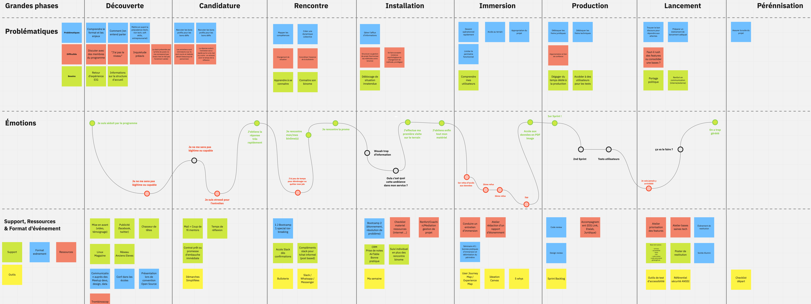

*[user journey]: Cartographie d'un parcours utilisateur permettant de décrire son expérience lors de l'utilisation d'un service/produit

# Expérience de parcours d'un EIG (*User Journey*)

Suite à un atelier ([plénière du 10/10/2019](https://doc.eig-forever.org/accompagnement.html#session-du-10-octobre-2019)) entre plusieurs EIG, le parcours d'un EIG sous le format *user journey* a été produit.

Voici ce que l'on peut retenir :

