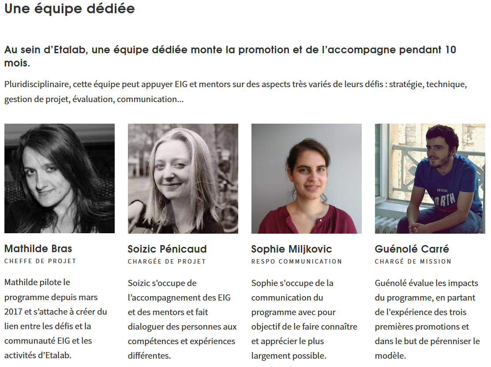

# Bienvenue 

Ce document a pour objectif de donner quelques éléments de contexte et de faciliter l'intégration des nouveaux membres du programme. 

[[toc]]

Bonjour,
Vous venez d’arriver dans votre administration d’accueil dans le cadre de votre défi. Pour vous aider dans cette phase d’intégration, laissez nous vous présenter quelques ressources pour vous aider.

Tout d’abord, qui sommes-nous ? 
L'équipe du programme est en charge de l'accompagnement des promotions EIG et DIG. Une brève présentation se trouve dans l'image ci-dessous afin de vous familiariser avec les membres de l'équipe.

### Quels sont les autres défis ? 

La liste des autres défis, des promotions en cours ainsi que des promotions précédentes, est [disponible sur le site du programme](https://entrepreneur-interet-general.etalab.gouv.fr/defis.html).

Les défis DIG : 
* Aider à sauver des vies grâce à une application liée aux numéros d’urgence 18 et 112 (NexSIS). Agence de la Sécurité Civile 
* Faciliter le regroupement familial des étrangers en France grâce à un service en ligne. Direction de l'Information Légale et Administrative (DILA)
* Contribuer à la réussite de FranceConnect en imaginant le parcours utilisateur le plus léger possible. Direction Interministérielle du Numérique et des Systèmes d'Information et de Communication de l'État (DINSIC)
* Bâtir une identité numérique de l’État simple, ergonomique et sécurisée. Mission Identité Numérique 
* Améliorer la compréhension des remboursements de l’assurance maladie sur le compte ameli. Caisse Nationale d'Assurance Maladie
* Mieux informer les citoyens sur les risques de crues via le site vigicrues.gouv.fr (VigicrUX). Service central d’hydrométéorologie et d’appui à la prévision des inondations (SCHAPI)
* Améliorer l’expérience utilisateur des portails de diffusion du Shom (MaritUX).	Service hydrographique et océanographique de la marine (Shom)
* Améliorer l’information environnementale du citoyen grâce à la refonte des dispositifs de diffusion en mode collaboratif. Commissariat Général au Développement Durable
* Faciliter l’accès aux achats du ministère des Armées par la refonte de son service en ligne.	Ministère des Armées
* Améliorer la communication et la collaboration des 1,2 million d’agents de l’Éducation nationale grâce à des outils numériques.	Ministère de l'Éducation Nationale
* Faire découvrir les espaces naturels grâce à une application de géolocalisation.	Muséum Histoire Naturelle
* Favoriser la résorption des bidonvilles grâce à une plateforme de partage d’informations (Action bidonvilles). Délégation interministérielle à l’hébergement et à l’accès au logement (DIHAL)
* Parcours candidat optimisé.	Direction Générale de la Gendarmerie Nationale (DGGN)
* Apporter des réponses en ligne aux agents de l’Éducation nationale (Proxi RH). Académie de Lyon
* Faciliter la prise de rendez-vous en préfecture en créant un outil en ligne. Ministère de l'Intérieur
* Simplifier le parcours des familles dont les enfants sont en situation de handicap. Académie de Clermont-Ferrand

*Insérer une carte pour localiser les défis*

### Quel accompagnement ? 

Pour vous suivre tout au long de vos défis, l'équipe du programme a mis en place un programme d'accompagnement.

**Programme DIG 2019-2020**

| SESSIONS D'ACCOMPAGNEMENT | DATES | HORAIRES | LIEU | THÉMATIQUE | OBJECTIFS 
| -------- | -------- | ------- | ------- | ------ | ----- |
| Session DIG | 30 août | 9h30-18h30 | LapTop | ------ | ----- |
| Session DIG + Mentors l'après-midi | 26 septembre | 9h30-18h30 | LapTop | ------ | ----- |
| Session Mentors seuls | 11 octobre | 14h-18h30 | LapTop | ------ | ----- |
| Session DIG | 24 octobre | 9h30-18h30 | LapTop | ------ | ----- |
| Session DIG + Mentors | 28 novembre | 9h30-18h30 | LapTop | ------ | ----- |
| Session DIG | 12 décembre | 9h30-18h30 | LapTop | ------ | ----- |

### Vous souhaitez nous contacter ? Comment communiquer dans la promotion ?

Un [guide de bonnes pratiques](https://doc.eig-forever.org/communication.html) est disponible sur le site de documentation.

N'hésitez pas à nous adresser des mails pour que nous puissions répondre à vos questions à l'adresse entrepreneur-interet-general@data.gouv.fr.

### Ressources et articles

Afin de faciliter votre immersion dans vos administrations et au sein du programme, nous vous proposons la lecture de [certains articles de blog que nous avons publié sur notre site](https://entrepreneur-interet-general.etalab.gouv.fr/blog/).

**Sur les question de design au sein du programme :**
- [Sur la création d’outils en partant des besoins des utilisateurs](https://entrepreneur-interet-general.etalab.gouv.fr/blog/2018/04/12/atelier-product-research.html)
- [Une présentation de l’UX et des méthodes du design](https://entrepreneur-interet-general.etalab.gouv.fr/blog/2018/04/25/atelier-product-design.html)
- [Un récit de l'apport du design dans l'administration : Coline à l’ACOSS](https://entrepreneur-interet-general.etalab.gouv.fr/blog/2019/07/03/le-design-de-services-dans-une-administration.html)
- [Qu’est ce qu’un bon designer ?](https://entrepreneur-interet-general.etalab.gouv.fr/blog/2019/04/26/un-bon-designer-selon-Hugo-Stephan.html)

**Sur la méthode que nous employons pour nos défis :**
- [Construire une feuille de route et la faire évoluer :](https://entrepreneur-interet-general.etalab.gouv.fr/blog/2018/04/04/construire-une-feuille-de-route-partagee.html)
- [Quels suites pour les défis EIG ?](https://entrepreneur-interet-general.etalab.gouv.fr/blog/2019/05/20/session-perennisation-defis-eig-3.html)
- [Quelles ressources à Etalab ou à la DINSIC est-il possible de mobiliser pour avancer dans son défi ?](https://entrepreneur-interet-general.etalab.gouv.fr/blog/2019/03/12/bootcamp-eig3.html)
- [Les apprentissages des mentors et des EIG en pair à pair](https://entrepreneur-interet-general.etalab.gouv.fr/blog/2018/10/25/apprendre-et-progresser.html)
