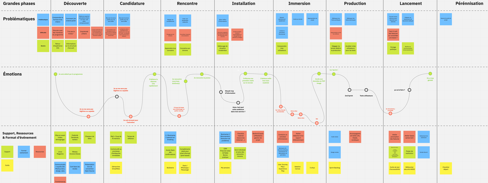

# Le programme EIG

[[toc]]

## Le programme EIG

### Qui sommes-nous ?

Le programme EIG existe depuis 2017. En 2019, une promotion expérimentale de Designers d'Intérêt Général a été lancée. 
Pour en savoir plus sur le programme EIG : [https://entrepreneur-interet-general.etalab.gouv.fr/presentation.html](https://entrepreneur-interet-general.etalab.gouv.fr/presentation.html)

### Être Entrepreneur d'intérêt général

Suite à un atelier ([plénière du 10/10/2019](https://doc.eig-forever.org/accompagnement.html#session-du-10-octobre-2019)) entre plusieurs EIG, une cartographie du parcours utilisateur d'un EIG a été créé.

### Retours sur le programme

Pour un aperçu de notre méthode et des ressources qui sont à votre disposition, vous pouvez lire quelques articles de notre blog :
- [Qui sont et que font les EIG ?](https://entrepreneur-interet-general.etalab.gouv.fr/blog/2020/05/25/etre-eig.html)
- [Les 6 facteurs clés de succès d’un défi EIG](https://entrepreneur-interet-general.etalab.gouv.fr/blog/2018/05/23/6-facteurs-de-reussite-defi-eig.html)
- [Quelles ressources mobiliser pour mener à bien un projet numérique dans l'administration](https://entrepreneur-interet-general.etalab.gouv.fr/blog/2019/03/12/bootcamp-eig3.html)